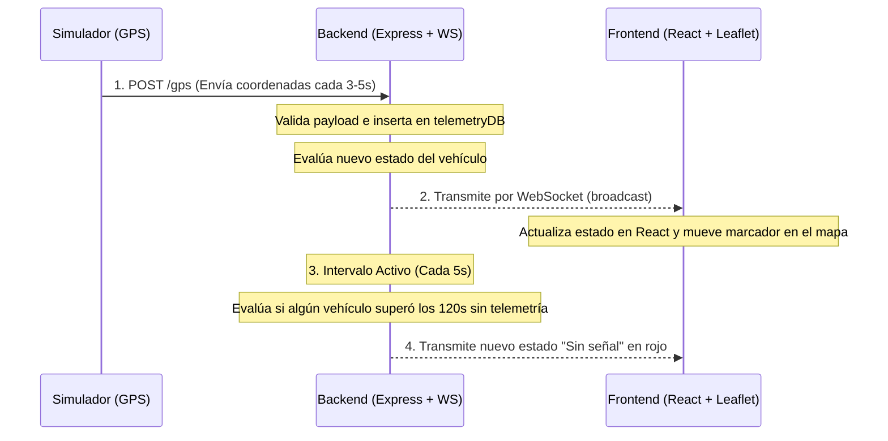

# Guía de Estudio y Explicación Técnica (Sustentación en Video)

Esta guía te proporcionará toda la información estructurada que necesitas para estudiar el sistema, entender el rol de cada archivo, la lógica de negocio detrás de la máquina de estados, el flujo de datos en tiempo real y cómo explicarlo de manera clara y profesional en tu video de 3 a 7 minutos.

---

## 📺 Estructura Sugerida para el Video (3 a 7 Minutos)

1. **Introducción (30s):** Preséntate, menciona la vacante a la que aspiras (Junior Fullstack Developer) y el objetivo del proyecto (Prototipo funcional de Telemetría GPS en tiempo real).
2. **Demostración Práctica (2 min):**
   - Muestra la consola corriendo los tres servicios (`npm run dev`).
   - Muestra el navegador con el dashboard en blanco.
   - Observa cómo los vehículos se mueven a lo largo de las carreteras reales de Bogotá y Cali.
   - Muestra que hay un contador en la parte superior con los diferentes estados.
   - **Explicación Clave:** Espera a que `VH-005` (el vehículo de pruebas) se quede sin señal. Muestra cómo el mapa y la barra lateral de `VH-005` se pintan de **rojo** y el contador de "Sin señal" sube a `1` automáticamente gracias a los WebSockets.
3. **Explicación del Backend (1.5 min):** Explica los endpoints REST, el uso de WebSockets para empujar cambios sin recargar y cómo evalúas si un vehículo está *En movimiento*, *Detenido* o *Sin señal*.
4. **Explicación del Frontend (1 min):** Explica cómo se integró Leaflet con React, el uso de CSS puro para la estética limpia y el mecanismo híbrido de conexión (WebSocket + Fallback a Polling).
5. **Cierre (30s):** Conclusión, mención de los tests unitarios y la eliminación de Docker para ejecución local simple.

---

## 🛠️ Arquitectura de Directorios y Archivos

El proyecto está estructurado como un **Monorepo** simple. Aquí tienes el rol detallado de cada archivo principal:

```
prueba-tecnica-telemetria/
├── package.json                   # Configuración del monorepo, define el script principal "npm run dev" usando 'concurrently'.
├── backend/                       # CARPETA DEL SERVIDOR API + WEBSOCKETS
│   ├── package.json               # Dependencias de backend (express, ws, cors, tsx, vitest).
│   ├── tsconfig.json              # Configuración de compilación de TypeScript para Node.js.
│   └── src/
│       ├── index.ts               # Servidor principal. Define puertos, endpoints REST, eventos WS y el intervalo de broadcast de 5s.
│       ├── types.ts               # Interfaces y definiciones de TypeScript (Telemetry, VehicleState).
│       ├── statusEvaluator.ts     # MÓDULO CRÍTICO: Lógica pura de la máquina de estados de los vehículos.
│       └── statusEvaluator.test.ts# Pruebas unitarias de la lógica de estados usando Vitest.
├── frontend/                      # CARPETA DE LA INTERFAZ DE USUARIO (DASHBOARD)
│   ├── package.json               # Dependencias del cliente (react, leaflet, lucide-react).
│   ├── index.html                 # Página base de la SPA. Carga la fuente y los estilos CSS globales.
│   ├── vite.config.ts             # Configuración del compilador ultrarrápido Vite.
│   └── src/
│       ├── main.tsx               # Punto de entrada de React. Renderiza el componente App dentro de StrictMode.
│       ├── App.tsx                # COMPONENTE PRINCIPAL: Conexión WebSocket, estado de React, renderizado del mapa Leaflet y sidebar.
│       └── index.css              # ESTILOS CSS: Diseño glassmorphism, paleta light-mode, etiquetas flotantes y animaciones.
└── simulator/                     # CARPETA DEL SIMULADOR DE VEHÍCULOS
    ├── package.json               # Dependencias del simulador (node-fetch).
    ├── simulator.js               # Script que simula las 5 rutas reales, inyecta coordenadas, errores (10%) y ciclos de corte de señal.
    └── vehicles.json              # Base de datos estática con las coordenadas (waypoints) por carretera de las 5 rutas en Bogotá/Cali.
```

---

## 🔄 Flujo de Datos en Tiempo Real (Paso a Paso)

El flujo de información se ejecuta de la siguiente manera:



---

## 💾 La Base de Datos (Base de Datos en Memoria)

* **¿Qué se usó?** Un mapa de JavaScript en memoria: `const telemetryDB = new Map<string, Telemetry[]>();`.
* **¿Por qué se eligió?** Al ser un prototipo de telemetría de alta velocidad, almacenar las coordenadas temporalmente en memoria RAM permite procesar las lecturas con una latencia mínima de microsegundos, eliminando la necesidad de configurar bases de datos externas pesadas durante el proceso de desarrollo local.
* **Mantenimiento y Control de Fugas:** En `backend/src/index.ts`, limitamos el historial de cada vehículo a las últimas **100 posiciones** (`history.shift()`). Esto garantiza que la memoria RAM del servidor no crezca indefinidamente si el simulador corre por días.

---

## ⚙️ Explicación de la Lógica de Estados (statusEvaluator.ts)

Esta es la sección de código de la que más te preguntarán. Se calcula bajo tres condiciones temporales estrictas:

1. **Sin Señal (Rojo):**
   * Se compara la hora actual con el timestamp del último reporte recibido: `now - lastSeen`.
   * Si la diferencia es **mayor a 120 segundos**, el vehículo se marca automáticamente como `"Sin señal"`.
2. **Detenido (Amarillo):**
   * Si no está sin señal, revisamos el historial de coordenadas de atrás hacia adelante.
   * Buscamos el momento exacto en que el vehículo dejó de moverse (es decir, llegó por primera vez a su posición actual y se quedó estático allí).
   * Si el vehículo lleva en esa misma coordenada **más de 60 segundos**, su estado es `"Detenido"`.
3. **En Movimiento (Verde):**
   * Si el vehículo reporta posiciones distintas en los últimos 60 segundos, su estado es `"En movimiento"`.

---

## 🔌 API REST y Protocolos Usados

El sistema utiliza una arquitectura **híbrida** para la transmisión de información:

### 1. API REST (Para Ingesta y Operaciones CRUD)
* **`POST /gps`**: Utilizado por el simulador para enviar telemetría. Cuenta con validaciones estrictas para latitud (rango `[-90, 90]`), longitud (rango `[-180, 180]`), `vehicle_id` no vacío y fecha en formato ISO 8601.
* **`GET /vehicles`**: Retorna el estado actual resumido de toda la flota.
* **`GET /vehicles/:id`**: Retorna el estado de un único vehículo (devuelve `404` si no se encuentra).
* **`DELETE /vehicles/:id`**: Elimina un vehículo de la base de datos en memoria para soportar la limpieza del inventario.

### 2. WebSockets (Para Tiempo Real Dinámico)
* Se monta un servidor WebSocket (`ws`) sobre el mismo puerto HTTP (`3001`).
* **Conexión Inicial (`INIT`):** Cuando el panel web se abre, se conecta al socket y recibe inmediatamente el estado de todos los vehículos activos.
* **Actualizaciones (`UPDATE`):** Cada vez que entra una coordenada válida vía `POST /gps` o cuando el cronómetro del servidor detecta un corte de señal pasivo (cada 5s), el backend hace un *broadcast* de los estados actualizados a todos los clientes del WebSocket.

### 3. Mecanismo de Fallback (Polling de Respaldo)
* En `frontend/src/App.tsx`, si el servidor de WebSockets llega a caer o no logra establecer la conexión inicial por problemas de red, el frontend de React activa automáticamente un **polling HTTP de respaldo** que consulta `GET /vehicles` cada 5 segundos. Esto garantiza alta disponibilidad y tolerancia a fallos.

---

## 🎨 Aspectos Destacados del Diseño (Aesthetics & UX)

Si te preguntan por qué la interfaz se ve tan pulida y profesional, puedes justificar estas elecciones de diseño:
* **Mapa Estilo Google Maps:** Se reemplazó el fondo oscuro genérico por la capa estándar de **OpenStreetMap** que muestra etiquetas claras de autopistas, calles locales, nombres de ciudades y relieve, haciendo que se parezca más a los sistemas reales de logística empresarial.
* **100% sobre la Carretera:** Se eliminó cualquier ruido o desviación aleatoria sobre las coordenadas de los vehículos. Ahora los puntos simulan trayectorias exactas trazadas sobre las avenidas principales de Bogotá (Avenida Boyacá, Caracas, NQS) y de Cali.
* **Etiquetas Flotantes (Floating Tooltips):** En lugar de usar marcadores genéricos donde debes adivinar cuál es cuál, creamos marcadores personalizados con Leaflet que renderizan el ID del vehículo directamente sobre la chincheta (ej: `VH-001`), ahorrando clics al usuario.
* **Diseño Glassmorphic:** La barra lateral y el panel de KPIs en la parte superior utilizan un estilo moderno con bordes semitransparentes, desenfoque de fondo (`backdrop-filter: blur`) y sombras suaves para dar una sensación de profundidad de sistema operativo moderno.

---

*¡Con esta guía tendrás todos los conceptos técnicos claros y listos para brillar en tu sustentación en video! Éxitos.*
